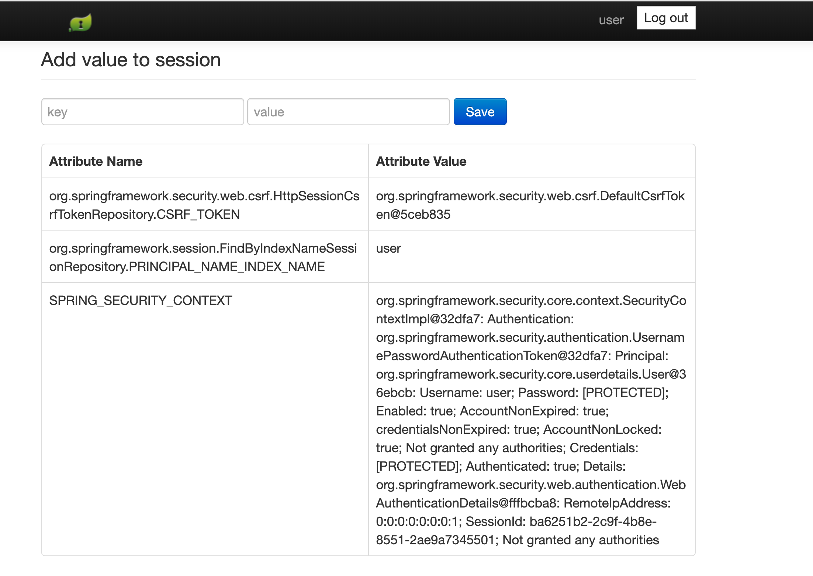

<!--Copyright (C) 2019-Present Pivotal Software, Inc. All rights reserved.

This program and the accompanying materials are made available under the terms of the under the Apache License, Version
2.0 (the "License”); you may not use this file except in compliance with the License. You may obtain a copy of the
License at

http://www.apache.org/licenses/LICENSE-2.0

Unless required by applicable law or agreed to in writing, software distributed under the License is distributed on an
"AS IS" BASIS, WITHOUT WARRANTIES OR CONDITIONS OF ANY KIND, either express or implied. See the License for the specific
language governing permissions and limitations under the License.-->

# Spring Session Sample Boot JSON

The projects in this directory illustrate a standard Spring Boot application using Spring Session to save session data
with either Redis or Cloud Cache. In this example, the Redis version serialized the session data to JSON format before
storing it in the cache.In this guide, we will highlight the changes necessary for switching from Redis to Cloud Cache
for session state caching utilizing the
[Spring Boot for Pivotal GemFire Session starter](https://docs.spring.io/autorepo/docs/spring-boot-data-geode-build/current/reference/html5/#introduction).

## How to Convert from Redis to Cloud Cache

### Update `build.gradle`
The Spring Boot Redis dependencies need to be updated to use Cloud Cache.

Remove these dependencies:


```java
implementation 'org.springframework.boot:spring-boot-starter-data-redis'
implementation 'org.springframework.session:spring-session-data-redis'
```

Replace them with these dependencies:

```java
implementation 'org.springframework.geode:spring-gemfire-starter-session:1.2.4.RELEASE'
implementation 'org.springframework.session:spring-session-data-geode:2.2.2.RELEASE'
```

To utilize the Cloud Cache dependencies, you must add the credentials and the url for the
[Pivotal Maven Commercial repo](https://commercial-repo.pivotal.io/login/auth) to
the repositories block. The resulting repositories section should look something like this:

```java
repositories {
    mavenCentral()
    maven {
        credentials {
            username "$gemfireReleaseRepoUser"
            password "$gemfireReleaseRepoPassword"
        }
        url "https://commercial-repo.pivotal.io/data3/gemfire-release-repo/gemfire"
    }
}
```

### Update `gradle.properties`
Add your [Pivotal Maven Commercial repo](https://commercial-repo.pivotal.io/login/auth) username and password to the
`gradle.properties` file:

```properties
gemfireReleaseRepoUser=<USERNAME>
gemfireReleaseRepoPassword=<PASSWORD>
```

Replace `<USERNAME>` with your username and `<PASSWORD>` with your password. If you do not have a username and
passsword, register [here](https://commercial-repo.pivotal.io/login/auth) to get an account.

### Add `@EnableClusterAware`
In your main application or config class (in this example `Application.java`), import and add the `@EnableClusterAware` 
annotation:

```java
import org.springframework.geode.config.annotation.EnableClusterAware;

@SpringBootApplication
@EnableClusterAware
public class Application {

	public static void main(String[] args) {
		SpringApplication.run(Application.class, args);
	}

}
```

### Remove Redis Bean from `WebMvcConfig`
This example needed the following Bean to use Redis on the Pivotal Platform. You can remove this bean and its imports
if your app is currently using it for Redis. It is not needed for Cloud Cache.

```java
@Bean
public static ConfigureRedisAction configureRedisAction() {
    return ConfigureRedisAction.NO_OP;
}
```

### Remove the `SessionConfig` Class
For Redis, it is sometimes necessary to provide a specific serializer to control how data is stored on the server. This
is not necessary for Cloud Cache, which by default provides the [PDX Serializer](https://gemfire.docs.pivotal.io/99/geode/developing/data_serialization/gemfire_pdx_serialization.html).
Therefore the SessionConfig class is no longer needed and should be removed.

### Optional/Housekeeping
For most projects, the following changes will not be necessary, but in this example the Cloud Cache application is a
separate, self-contained project and these tweaks were needed:

- In `settings.gradle`, update the `rootProject.name` from `bootjson.session.redis` to `bootjson.session.cloudcache`.
- In `manifest.yml`, update the JAR name in `path` from `bootjson.session.redis` to `bootjson.session.cloudcache`.

## Running the Cloud Cache Application

Navigate to the Cloud Cache application directory and execute the following command:
```bash
./gradlew bootRun
```
**Note:** If you do not have a local GemFire/Cloud Cache instance running, you will see an exception logged of the form:
`Could not connect to: localhost:40404`. The application is still running normally using the internal cache
implementation.

Go to localhost:8080 in your browser of choice. You should see a login screen like the following:


If you haven't changed the password or user, you can login with the username of `user` and password of `password`.

Once you've logged in successfully, you should see a page similar to the following:


You can use the form to add attributes to the session. You should be able to refresh the page or close the tab
and open a new one, but when you navigate back to the application you will still be logged in, and the attributes will
still be present.

**Note:** When running these examples on the Pivotal Platform, you will need to update the manifest.yml file to bind to your
Redis or [Cloud Cache](https://docs.pivotal.io/cloud-cache-dev/get-started#test-pas) service instance.

## Notes on Testing
For these applications, the intention was to demonstrate how to migrate from Redis to Cloud Cache.  If your tests are 
not specific to either framework, they should still pass once you've migrated.