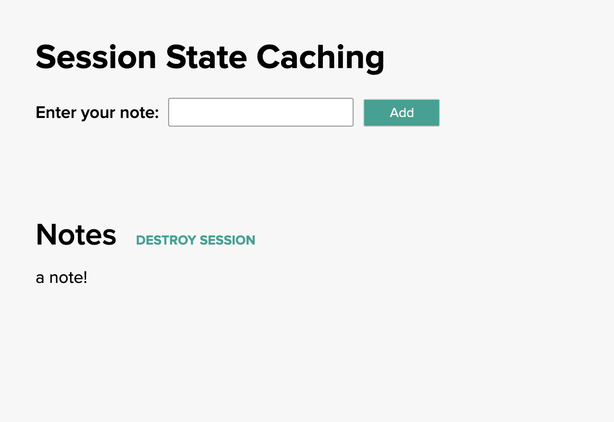

<!-- Copyright (C) 2019-Present Pivotal Software, Inc. All rights reserved.

This program and the accompanying materials are made available under the terms of the under the Apache License, Version
2.0 (the "License”); you may not use this file except in compliance with the License. You may obtain a copy of the
License at

http://www.apache.org/licenses/LICENSE-2.0

Unless required by applicable law or agreed to in writing, software distributed under the License is distributed on an
"AS IS" BASIS, WITHOUT WARRANTIES OR CONDITIONS OF ANY KIND, either express or implied. See the License for the specific
language governing permissions and limitations under the License. -->
 
# Session State Code Example

This guide walks you through how to implement a session state cache using Cloud Cache in a Spring Boot application.

## When should I use a session state cache?

Session state caching is useful for storing data associated with an HTTP session.  Storing this data in a cache allows
it to  be retrieved quickly and persisted across logins. Some examples where this might be useful include:

- Shopping cart entries
- User preferences (name, site theme, etc.) 
- Single Sign On (SSO) credentials
- Site Navigation History
    
## How does session state caching work?

When a user connects to a website that utilizes sessions, an HTTP session is created.

In our example the Spring Session library takes care of managing the user session.  When a user connects, a unique ID
for the session is generated and stored as a cookie in the user’s browser. On subsequent requests, the cookie is sent
to the server, identifying the session.	

The session UUID is used as a key in a data store holding information associated with the session (see examples of
session data above.) The data store can be a traditional database,but this can lead to performance issues when there is
a large volume of users, or user data, or both. A cache can improve performance in these cases.

## What you’ll need

To complete this guide you need:
- A favorite text editor or IDE
- JDK 8 or 11
- A Spring Boot 2.2.x application
- Spring-gemfire-starter-session 1.2.x 
- A Pivotal Commercial Maven Repo account


## Where do we begin?

This example consists of a simple Spring Boot application and a front end application that records user-provided notes,
and associates them with the user’s session. If the user navigates away, and then returns to the site, their notes will
still be available. The app also offers the ability to destroy the session - analogous to logging out of a website.

The back end (in the `src/main/java/sessionstate/` directory) handles all the session management and storage, and is the
main focus of the example. The front end (in the `frontend/` directory) is only provided to exercise the back end and
illustrate how a web app can interact with the session data. The example front end is written using the React framework,
but clients could use any language or framework capable of interacting with a REST endpoint.


### 1. Add dependency and repository information

To allow the application to work with Pivotal Cloud Cache and utilize the [Spring Boot For Pivotal GemFire Session
starter](https://docs.spring.io/spring-boot-data-geode-build/1.2.x-SNAPSHOT/reference/html5/#geode-session) dependency,
add the following dependency information to the `build.gradle` file:


```groovy
repositories {
   mavenCentral()
   maven {
       credentials {
           username "$gemfireReleaseRepoUser"
           password "$gemfireReleaseRepoPassword"
       }
       url "https://commercial-repo.pivotal.io/data3/gemfire-release-repo/gemfire"
   }
}

dependencies {
  implementation 'org.springframework.geode:spring-gemfire-starter-session:1.2.4.RELEASE'
  implementation 'org.springframework.session:spring-session-data-geode:2.2.2.RELEASE'
  
   implementation 'org.springframework.boot:spring-boot-starter-web'
   testImplementation('org.springframework.boot:spring-boot-starter-test')
}
```

Then add the variable information in a `gradle.properties` file:
```properties
# Register here: https://commercial-repo.pivotal.io/login/auth to get your username and password
# For further details, see the README for the Hello World app:
# https://github.com/pivotal/cloud-cache-examples/tree/master/hello-world#app-dependencies

gemfireReleaseRepoUser=<USERNAME>
gemfireReleaseRepoPassword=<PASSWORD>
javaVersion=1.8
```
Where `<USERNAME>` and `<PASSWORD>` is your [Pivotal Commercial Maven Repo](https://commercial-repo.pivotal.io/login/auth)
account information.

### 2. Backend App And Controller

The Spring Boot application will need the following annotations:

```java
@SpringBootApplication
@EnableClusterAware
public class SessionStateApplication {
  public static void main(String[] args) {
     SpringApplication.run(SessionStateApplication.class, args);
  }
}
```

[@EnableClusterAware](https://docs.spring.io/autorepo/docs/spring-boot-data-geode-build/current/reference/html5/#geode-configuration-declarative-annotations-productivity-enableclusteraware)
Allows the application to seamlessly switch between local-only (application running on local machine) and client/server
(application running on PAS).  This annotation includes the 
[@EnableClusterConfiguration](https://docs.spring.io/spring-data/geode/docs/current/reference/html/#bootstrap-annotation-config-cluster)
annotation, which dynamically creates regions if they do not exist already. Note that the `@EnableClusterConfiguration`
annotation will only create Regions, it will not delete or update existing regions.

The example Spring Boot application uses a `RestController` that allows the front end application to interact with a REST API to read, update, and destroy session data:

```java
@RestController
public class SessionController {
    @GetMapping("/getSessionNotes")
    public List<String> getSessionNotes(HttpServletRequest request) {
        List<String> notes = (List<String>) request.getSession().getAttribute("NOTES");
        return notes;
    }

    @PostMapping("/addSessionNote")
    public void addSessionNote(@RequestBody String note, HttpServletRequest request) {
        List<String> notes = (List<String>) request.getSession().getAttribute("NOTES");

        if (notes == null) {
            notes = new ArrayList<>();
        }

        notes.add(note);
        request.getSession().setAttribute("NOTES", notes);
    }

    @PostMapping("/invalidateSession")
    public void invalidateSession(HttpServletRequest request) {
        request.getSession(false).invalidate();
    }
}
```

### 3. Accessing and Displaying Session Data from the Front End 

The front end web application accesses the back end REST API using standard GET and POST HTTP methods. See
`frontend/src/sessionService.js`:

```javascript
const instance = axios.create();

const addNote = async (note) => {
   await instance.post('/addSessionNote', note,{
       headers: { 'Content-Type': 'text/plain' }
   });
};

const getNotes = async () => {
   const response = await instance.get('/getSessionNotes');
   return response.data;
};

const destroySession = async () => {
   await instance.post('/invalidateSession');
};
```

### 4. Build and Run the application!

To build and run the application **locally**, execute the command `./gradlew bootRun` 

**Note:** If you do not have a local GemFire/Cloud Cache instance running, you will see an exception logged of the form:
`Could not connect to: localhost:40404`. The application is still running normally using the internal cache
implementation.

The web application will be
accessible at [http://localhost:8080](http://localhost:8080) by default. The "Enter your note:" form can be
used to enter notes. The “DESTROY SESSION” button can be used to clear the session data and delete the notes.



To run the application **on the Pivotal Platform with Cloud Cache**, first make sure you’ve [created a service
instance](https://docs.pivotal.io/cloud-cache-dev/get-started#test-pas) that you can bind your application to. Then
in the `manifest.yml`, replace the `<SERVICE-INSTANCE-NAME>` with the name of your service instance. 

Execute the command `./gradlew build` to build the application. Then, execute the command `cf push` to deploy the
application to PCF.

That's it!

## Testing Strategies

The API is tested using standard Spring Boot techniques, such as `@RunWith(SpringRunner.class)` and `MockMvc`. There are
two notable items in the test class.

1. It autowires a `CacheManager`, and accesses it to confirm that session data is properly stored in the cache.
2. The tests are annotated with `@DirtiesContext` to destroy the test region between test runs, to avoid test pollution.

```java
@RunWith(SpringRunner.class)
@SpringBootTest(classes = SessionStateApplication.class)
@AutoConfigureMockMvc
public class SessionControllerTest {
   @Autowired
   MockMvc mockMvc;

   @Autowired
   CacheManager cacheManager;

   static String NOTE1 = "Nothing More Than Memories";

...

   @Test
   @DirtiesContext
   public void addSessionNote_should_addNoteToSessionInCache() throws Exception {
       MvcResult mvcResult = mockMvc.perform(post("/addSessionNote")
               .content(NOTE1))
               .andExpect(status().isOk())
               .andReturn();

       String encodedSessionUUID = mvcResult.getResponse().getCookie("SESSION").getValue();

       List<String> notesList = getNotesForSessionInCache(encodedSessionUUID);

       assertEquals(NOTE1, (notesList.get(0)));
   }
...
```